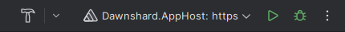
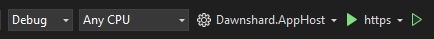

# DragaliaAPI

DragaliaAPI is the main server component of Dawnshard, which handles the vast majority of game functionality.

## Dependencies

The server depends on [`DragaliaBaas`](https://github.com/DragaliaLostRevival/DragaliaBaasServer) as an identity
provider. Clients are expected to go to an instance of the BaaS for login and authentication, and then come back
to `/tool/auth` with a signed JSON web token to authenticate against DragaliaAPI. The development instance is configured to point
at a publicly hosted instance of BaaS.

## Development environment

### Run the server

For local development, the recommended workflow is using the [.NET Aspire](https://learn.microsoft.com/en-us/dotnet/aspire/get-started/aspire-overview) AppHost.
This will handle starting up the app and spinning up Docker containers for the dependent services.

This has the following dependencies:

- A container runtime. On Windows, [Docker Desktop](https://docs.docker.com/desktop/install/windows-install/) is required to run Linux containers.
- The .NET Aspire workload.

For more information, see the [Microsoft documentation on setting up .NET Aspire](https://learn.microsoft.com/en-us/dotnet/aspire/fundamentals/setup-tooling).

The Aspire app host should be compatible with most IDEs like JetBrains Rider and Visual Studio. Simply select the `Dawnshard.AppHost: https` launch profile to start it up.

Rider:  

Visual Studio:  


Alternatively, you can use the command line. From the repository root:

```
$ cd Dawnshard.AppHost
$ dotnet run
```

### Set up a client

The `launchSettings.json` file will start the server on port 80, so you can
use [Dragalipatch](https://github.com/LukeFZ/DragaliPatch/releases/latest) with
your [PC's local IP address](https://support.microsoft.com/en-us/windows/find-your-ip-address-in-windows-f21a9bbc-c582-55cd-35e0-73431160a1b9)
to play on your local server with an emulator or mobile device. You must input the local IP address
as `http://192.168.xxx.xxx` because without a http prefix, Dragalipatch assumes HTTPS which is not enabled on the
development setup.

## Self-hosting for general use

### Locally

The recommended way to self-host is using `docker-compose` -- please see
the [self-hosting guide](https://github.com/SapiensAnatis/Dawnshard/wiki/Self-hosting-guide) in the wiki for more
information.

### Dedicated server

On a dedicated server, additional considerations should be made
regarding reverse proxying, logging, etc. Speak to the maintainer if you are interested in hosting your own instance for
further guidance.


